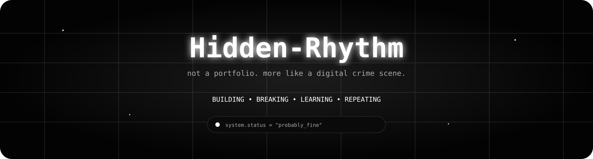
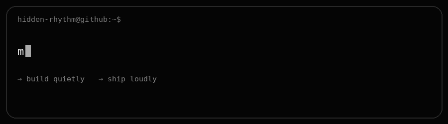
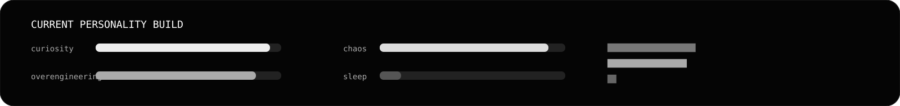

<div align="center">



<br><br>

<a href="https://github.com/Hidden-Rhythm">

</a>
<a href="https://github.com/Hidden-Rhythm?tab=repositories">

</a>
<a href="https://komarev.com/ghpvc/?username=Hidden-Rhythm">

</a>

<br><br>



</div>

---

<div align="center">

### `welcome to the part of github where i keep making things`

**i don't really have a plan.**  
**i just have ideas.**

</div>

<br>

## 🧠 `about_me.exe`

```text
╭──────────────────────────────────────────────────────────────╮
│                                                              │
│  > booting Hidden-Rhythm...                                  │
│                                                              │
│  ✓ curiosity        loaded                                   │
│  ✓ questionable     loaded                                   │
│  ✓ overengineering  loaded                                   │
│  ✓ sleep schedule   not found                                │
│                                                              │
│  current mission:                                            │
│  turn "wait... what if..." into something that actually runs │
│                                                              │
╰──────────────────────────────────────────────────────────────╯
```

> `the things i don't say, i build.`

i make **websites, bots, tools, experiments and random little things** that seem like a good idea at 2 AM.

sometimes they're useful.

sometimes they're completely unnecessary.

**those are usually the fun ones.**

---

## ⚡ `current_personality`

<div align="center">



</div>

---

## 🛠️ `things_i_speak`

<div align="center">


<br><br>

`python` · `javascript` · `typescript` · `react` · `next.js` · `tailwind` · `node.js`

</div>

---

## 🚧 `things_under_construction`

<table align="center">
<tr>
<td width="33%" align="center">

### 🌐

**WEB**

beautiful things  
that probably  
didn't need to exist

</td>
<td width="33%" align="center">

### 🤖

**AUTOMATION**

bots, APIs, scripts  
and machines doing  
the boring stuff

</td>
<td width="33%" align="center">

### 🧪

**EXPERIMENTS**

random ideas  
with suspiciously  
high effort

</td>
</tr>
</table>

---

## 📡 `github_transmission`

<div align="center">


<br>


</div>

---

## 🐍 `apparently_i_commit_too`

<div align="center">


</div>

---

## 🎮 `some_stuff_i_made`

<div align="center">

<a href="https://github.com/Hidden-Rhythm/here-is-your-gift">

</a>

<a href="https://github.com/Hidden-Rhythm/for-my-cutiepie">

</a>

<a href="https://github.com/Hidden-Rhythm/Calculator">

</a>

</div>

---

## 💀 `debug.log`

```text
[02:11] "i'll make something quick"
[02:17] opened vscode
[02:31] changed the entire design
[03:04] added an animation
[03:19] broke the animation
[03:42] fixed the animation
[04:01] "one last feature"
[04:46] added seven features
[05:02] git add .
[05:03] git commit -m "final"
[05:03] lied
```

---

## 🪐 `things_i_believe`

<div align="center">

> **make it work.**  
> **make it weird.**  
> **make it yours.**

<br>

`curiosity > perfection`

`ideas > excuses`

`shipping > talking`

</div>

---

## 👀 `you_found_the_bottom`

<div align="center">


<br>

### if you read all this...

**you officially wasted more time here than i expected.**

<br>

<a href="https://github.com/Hidden-Rhythm">

</a>

</div>

<br>

<div align="center">


</div>
